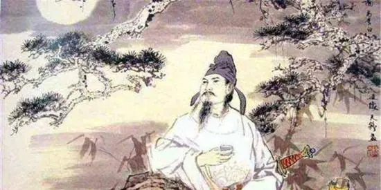
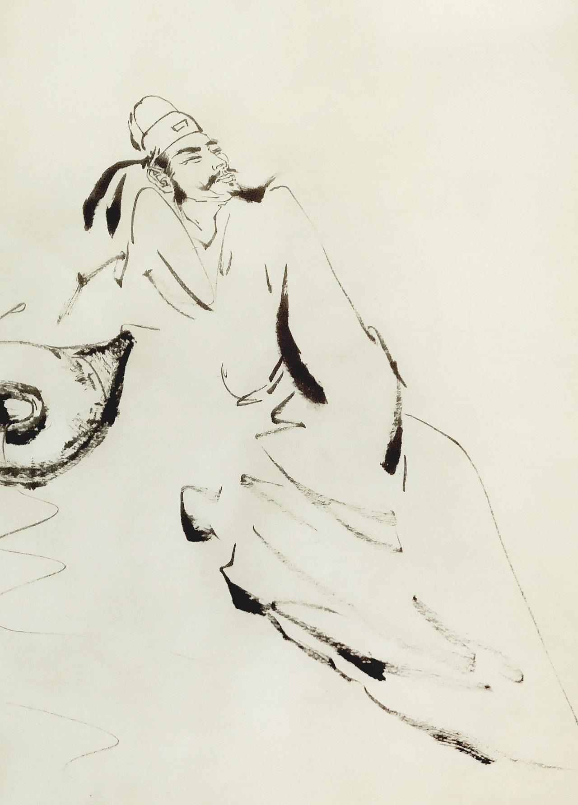

#一声狂笑，半个盛唐--李白
大唐繁荣昌盛，风气开放宽容，诗人层出不穷，犹如百花齐放百家争鸣，创造出大量绚烂夺目的文化诗歌。在这大唐诗歌盛行的黄金时代中，李白是最耀眼最杰出的诗人，也是中国文学史上伟大的浪漫主义诗人，被世人尊称为“诗仙”。

所谓诗如其人，伟大的诗人都喜欢将自己的个性和他们创作的诗歌相结合在一起。李白个性狂傲不羁、豪迈潇洒，他身上凝聚了唐人的自信骄傲，可以说是盛唐精神的代表。独特的个性，造就独特的诗歌，李白的诗风飘逸豪迈不拘一格，如天马行空一般，令人惊叹不已。

在李白的诗歌中，山河景色都显得那么生动神奇。《渡荆门送别》“山随平野尽，江入大荒流。”山逐渐消失了，眼前是一望无际的低平的原野。从荆门往远处望去，仿佛流入荒漠辽远的原野，显得天空寥廓，境界高远。短短两句诗却给人如此宏大辽阔的空间美感。

《侠客行》“十步杀一人，千里不留行。事了拂衣去，深藏身与名。”描述侠客来去无影，弹指之间夺人性命的武功气势，称赞侠客行侠仗义、不图名利的高尚人格。诗句抒发了李白对侠客拯危济难的仰慕和向往，同时也是他的自我写照，因为李白除了诗人身份之外，同时还是一名剑客，他的豪情壮志在诗中显露无遗。

中华文化史上，酒占有一种非常特殊的地位，处处散发着华夏文明的芳香。不论是才子佳人还是文臣武将，都对酒有所偏爱，诗仙李白更是如此。李白喜爱饮酒作诗，他的很多诗句都带着酒，因为喝酒更能让他无拘无束，充分释放内心自由洒脱的真性情，他因此还被世人称为“酒仙”。

《将进酒》“人生得意须尽欢，莫使金樽空对月。”“古来圣贤皆寂寞，唯有饮者留其名。”“五花马，千金裘，呼尔将出换美酒，与尔同销万古愁。”李白身怀报国之志却惨遭小人排挤，于是常常借酒兴诗情，以抒发心中的不平。诗句既有飘逸浪漫、潇洒自在，也包含万千悲慨、郁结失意。

李白一生好酒，这是和他追求独立自由紧密联系的，他和酒的联系是自然感性的，充满解放个性的超越时代精神。从《将进酒》可以看出酒仙李白的狂傲不羁和悲忧孤独，怀才不遇的他把悲愤之情化为饮酒作诗的豪情之举，尽显其潇洒豪迈气概和傲世独立的个性。

《静夜思》“床前明月光，疑是地上霜。举头望明月，低头思故乡。”这是李白在盛唐时期创作的五言绝句，没有奇特新颖的想象，没有精工华美的辞藻，只是用叙述的语气，写远客思乡之情，然而它却意味深长，耐人寻绎，传颂千古。!

此诗描写了秋日夜晚，诗人李白于屋内抬头望月的所感。短短四句诗，表达诗人客居思乡之情，语言清新朴素而韵味含蓄无穷。构思细致而深曲，脱口而饮、浑然天成，这是李白对诗歌风格的推崇追求，体现了“清水出芙蓉,天然去雕饰。”清新自然的意境。

李白的诗很容易震撼人心，引人入胜。我们喜欢李白的诗，因为不论他得意还是失意之时，诗歌文字中都充满豪气和情义，表达出他最真实的情感，让人感同身受，产生共鸣之情。李白吸引我们的是他诗酒风流、轻剑快马般自然洒脱，既文采斐然、清高傲岸，又快意恩仇、行侠仗义，将诗仙、侠客、酒仙三者完美结合为一体。

李白才华震古烁今，无论是同时代的著名诗人还是后世文人都纷纷赞叹他惊才绝艳。著名诗人贺知章第一次读李白的诗便惊叹他是“谪仙人”；“诗圣”杜甫称赞李白“白也诗无敌，飘然思不群”、“笔落惊风雨，诗成泣鬼神。”；当代诗人余光中在《寻李白》中说：“酒入豪肠，七分酿成了月光，余下的三分啸成剑气，绣口一吐就半个盛唐。”

在天地逆旅中，李白一生都活得自在洒脱，与大唐的辉煌大气一脉相承。他的身上，有着来自壮丽山河的磅礴豪迈，带着美酒在江湖行侠仗义中潇洒恣意。如天生我材必有用般自信，如梦游天姥吟留别般超然，与天地山河为友，和清风明月对饮，于浮生若梦中成为“诗仙”而流芳百世、名传千古。!